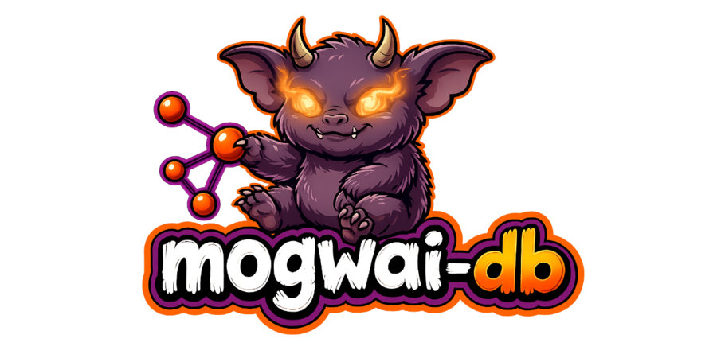
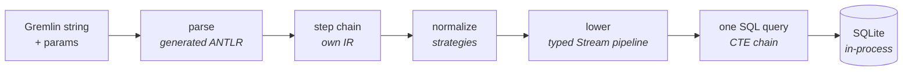

<p align="center">
  
</p>

# mogwai-db

**A TinkerPop 4 Gremlin graph database that compiles to SQLite — one isolated
graph per Cloudflare Durable Object, driveable by any TinkerPop client or, over
its built-in REST + OpenAPI surface, by an agent.**

Point any TinkerPop 4 client at it and it speaks Gremlin over the standard HTTP
wire. Under the hood every traversal is **compiled to one SQL query** and run by
SQLite's planner — it never interprets the graph row-at-a-time. One Durable
Object is one graph, so per-tenant isolation and scale-to-zero are free.

> ### Status: pre-alpha — design in the open, not for production
>
> Actively developed on `trunk`; not yet deployed, no auth, expect churn. Shared
> so the design and progress are visible, not because it's usable yet.
>
> - **Understands the whole language** — 2,298 / 2,298 canonical Gremlin
>   traversals from the official corpus parse (100%).
> - **Executes correctly** — **<!-- L3:passing -->1,762<!-- /L3:passing -->** official TinkerPop Gherkin scenarios pass
>   against a live server through the *unmodified* `gremlin` JS client at tinkerpop `origin/master`,
>   run under `bun test` as a **ratchet** (the number only goes up).
> - **Reads + writes + strategies** land across a wide step surface. For the exact
>   per-step edges see the **[feature support matrix](docs/feature-support-matrix.md)**.
> - **Next:** per-graph auth + a real Cloudflare deploy, then the conformance grind.

## Why compile Gremlin to SQL?

Most Gremlin engines interpret a traversal by walking it step-by-step, pulling
rows as they go. mogwai-db instead **lowers the whole traversal to a single
parameterised SQL statement** and hands it to SQLite. The traversal runs *in the
same process as storage* — no query-engine-to-storage network hop — and k-hop
movement becomes index-only covering scans. The planner, indexes, and query
execution are SQLite's job; mogwai-db's job is the compile.



The lowering pipeline is a typed **Stream** model: each read step transforms an
immutable stream (elements → scalars → lists → groups → …), accumulating CTEs,
and the whole plan materialises to GraphBinary only at the root. Movement,
filters, projections, branching, recursion, paths, aggregation, side-effects and
the collection/string/date families all lower through this one engine — no
row-at-a-time interpreter anywhere.

## Where it fits (and where it doesn't)

mogwai-db is **not** trying to be Neptune or TigerGraph. It targets a different,
underserved corner: **many small-to-medium isolated graphs** — per-user knowledge
graphs, per-tenant SaaS graphs, agent memory, personal projects. One Durable
Object = one graph, so isolation is free and idle graphs cost essentially nothing.

**Poor fit:** one enormous graph or heavy analytics. A DO caps at ~10 GB of
SQLite, execution is single-threaded per graph, and the OLAP algorithm layer
isn't built yet (it's intended, and designed as compiled set-based passes rather
than a second engine). Shard-one-logical-graph or PageRank-at-scale is
Neptune/TigerGraph's job, not this.

The tick column is an honest **self-rating**: ✅✅ = a real edge · ✅ = on par ·
❌ = a weak spot for now. Other columns show where each database sits.

| Property | mogwai-db | Neptune | Cosmos (Gremlin) | Neo4j Aura | TigerGraph |
|---|---|---|---|---|---|
| Gremlin / TinkerPop | ✅✅ **v4** | v3 | v3 | Cypher | GSQL |
| Managed infra | ✅ Cloudflare-run | managed | managed | managed | managed |
| Scale-to-zero | ✅✅ ~$0 idle | no | no | no | no |
| Cheap per-tenant fleets | ✅✅ free | costly | costly | costly | costly |
| Single-graph scale | ❌ ~10 GB | ~unbounded | ~unbounded | large | large |
| OLAP | ❌ not yet | strong | weak | strong | strong |
| Maturity | ❌ **pre-alpha** | GA | GA | GA | GA |

Real edges: **idle cost, per-tenant isolation, v4 currency**. Honest concessions:
**the scale ceiling** (structural — one DO, one thread, ~10 GB) and — for now —
**maturity and OLAP**.

## Agent-driven by design

Graph lifecycle is a thin **REST layer on the same `/gremlin/{graph}` path** —
`PUT`/`GET`/`DELETE` create, inspect, and destroy a graph, identically on both
runtimes; data-plane queries `POST` to it. The server is **self-describing**:
`GET /openapi.json` serves an OpenAPI 3.1 spec and `/docs` an interactive
reference. TinkerPop has no data-plane database-provisioning API — here a graph
springs into being on first access, and management is in-band on the one path.

The direction of travel: that REST + OpenAPI surface makes mogwai-db a natural
**MCP-compatible, agent-driven graph database** — an agent can create graphs,
write, and traverse with no bespoke tooling, just the described HTTP contract.

## One codebase, two runtimes

Everything above the storage driver is runtime-agnostic; the platform leaf is
injected via DI. The same parser, compiler, and wire framing serve both:

- **Bun** (dev/local) — `Bun.serve` over `bun:sqlite`.
- **Cloudflare Durable Objects** (production) — one DO = one isolated graph over
  `ctx.storage.sql`; the Worker routes `POST /gremlin/{graph}` to the right DO
  and calls a native `query` RPC on it.

Both are SQLite, both synchronous, and one shared contract test runs against both
over the real GraphBinary wire — so they're proven identical, not tested twice.

## Run

Runtime is [Bun](https://bun.sh) (pinned via [mise](https://mise.jdx.dev)).
`mise install` to get it. The build graph is [mise tasks](mise.toml):
`install ─▶ {test, build} ─▶ ci`; CI just runs `mise run ci`.

```
mise run test      # full suite: corpus + contract (both runtimes) + L3 cucumber ratchet
mise run build     # bundle the Worker (wrangler dry-run)
mise run ci        # the gate: test + build

bun run start      # Bun server on :8182
bun run dev:cf     # Worker + DO under wrangler dev
bun run deploy     # wrangler deploy
```

`bun test` auto-provisions the pinned TinkerPop submodule (grammar + Gherkin
features + JS cucumber runner) and boots the Cloudflare half under `wrangler
dev`, so the first run may pause while it clones and `workerd` starts.

## Learn more

- **[Feature support matrix](docs/feature-support-matrix.md)** — the scannable,
  code-grounded map of what compiles and where each partial step stops.
- The name: *mogwai* (魔怪) is Cantonese for a mischievous little devil — fitting
  for a pocket-sized graph that speaks **Gremlin**, the TinkerPop query language.
