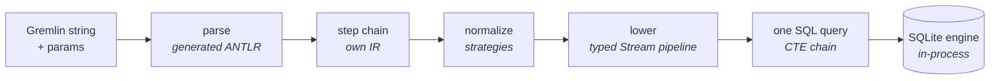

  

# mogwai-db

**A TinkerPop 4 graph database with SQLite as its engine — natively targeting the browser, edge, bare metal and Docker.**

Point any TinkerPop 4 client at it and it speaks Gremlin over the standard HTTP
wire — no bespoke driver. Underneath there's no graph query engine to run and
scale — just SQLite.

> ### Status: pre-alpha — design in the open, not for production
>
> Actively developed on `trunk`; no auth yet, expect churn. Shared so the design and
> progress are visible, not because it's production-ready.
>
> - **Understands the whole language** — 2,395 / 2,395 canonical Gremlin traversals
>   parse and chain (100%), through a parser generated from TinkerPop's own `Gremlin.g4`.
> - **Executes correctly** — **<!-- L3:passing -->1,797<!-- /L3:passing -->** official TinkerPop Gherkin scenarios pass
>   through the *unmodified* `gremlin` JS client (tinkerpop `origin/master`) over the real GraphBinary wire,
>   run as a **ratchet** (the number only goes up).
> - **Reads + writes + strategies** land across a wide step surface. For the exact
>   per-step edges see the **[feature support matrix](docs/feature-support-matrix.md)**.

## SQLite is the engine

A Gremlin traversal is normally run by walking its step chain one traverser at a
time. mogwai-db doesn't — it **lowers each whole traversal to a single parameterised
SQL statement** for SQLite to run. The traversal executes *in the same process as
storage* — no query-engine-to-storage hop — and k-hop movement becomes index-only
covering scans. The planner, indexes, and execution are SQLite's; mogwai-db's job is
the compile.

The lowering pipeline is a typed **Stream** model: each read step transforms an
immutable stream (elements → scalars → lists → groups → …), accumulating CTEs, and
the whole plan materialises to GraphBinary only at the root. Movement, filters,
projections, branching, recursion, paths, aggregation, side-effects and the
collection/string/date families all lower through this one engine — no row-at-a-time
interpreter anywhere.

## Runs everywhere

Because the engine is SQLite, mogwai-db runs wherever SQLite does. The parser,
compiler, and GraphBinary wire are platform-agnostic; only the synchronous **SQLite
leaf** changes per target — and one shared contract test runs against every backend
over the real wire, so they're proven identical, not tested twice. Every edition is
self-contained and published on each release ([Releases](../../releases)):

- **Browser** — SQLite compiled to WebAssembly (`opfs-sahpool`) behind a Service
  Worker; the whole database lives in the tab, no server. Unzip
  `mogwai-db-<version>-browser.zip` into a static folder and add
  `<script type="module" src="mogwai-db.js">` — an unmodified TinkerPop client or a
  plain `fetch` just works.
- **Edge — Cloudflare Durable Objects** — one DO = one isolated graph. Unzip
  `mogwai-db-<version>-cloudflare.zip`, set `CLOUDFLARE_API_TOKEN`, run `./deploy.sh`.
- **Bare metal** — a single self-contained binary (Linux, macOS, Windows; arm64 and
  amd64). Download `mogwai-db-<version>-<os>-<arch>` and run `./mogwai-db --data-dir ./graphs`
  (serves on `:8182`; `--help` for flags).
- **Docker** — a multi-arch image:
  `docker run -p 8182:8182 -v data:/data ghcr.io/bodar/mogwai-db:latest`.

Then talk to it: `POST /gremlin/{graph}` with `{"gremlin":"g.V().count()"}`, or point a
TinkerPop 4 GLV at the same URL. Management (`PUT`/`GET`/`DELETE`) is on the same path.

## Where it fits (and where it doesn't)

mogwai-db is **not** trying to be Neptune or TigerGraph. It targets a different,
underserved corner: **many small-to-medium isolated graphs** that live close to the
code that uses them — per-user knowledge graphs, per-tenant SaaS graphs, agent
memory, in-app graphs, personal projects. One graph is one SQLite database, so
isolation is free, and on Cloudflare an idle graph costs essentially nothing.

**Poor fit:** one enormous graph, or analytics *at scale*. A single graph is one
SQLite file / one Durable Object (~10 GB ceiling on Cloudflare) and execution is
single-threaded per graph, so shard-one-logical-graph or PageRank-over-a-billion-edges
is Neptune/TigerGraph's job, not this. The OLAP algorithms themselves are here and
growing — PageRank/ArticleRank/HITS, degree and betweenness centrality, connected
components (weak + strong), peer-pressure clustering, k-core, node similarity, triangle
count, and shortest path, all as compiled set-based passes — they just run one graph at
a time, not across a cluster.

The tick column is an honest **self-rating**: ✅✅ = a real edge · ✅ = on par ·
❌ = a weak spot for now. Other columns show where each database sits.

| Property | mogwai-db | Neptune | Cosmos (Gremlin) | Neo4j | TigerGraph |
|---|---|---|---|---|---|
| Gremlin / TinkerPop | ✅✅ **v4** | v3 | v3 | Cypher | GSQL |
| Runs | ✅✅ browser · edge · binary · docker | managed only | managed only | self-host · managed | self-host · managed |
| Scale-to-zero | ✅✅ ~$0 idle | no | no | no | no |
| Cheap per-tenant fleets | ✅✅ free | costly | costly | costly | costly |
| Single-graph scale | ❌ ~10 GB | ~unbounded | ~unbounded | large | large |
| OLAP | ✅ growing library | strong | weak | strong | strong |
| Maturity | ❌ **pre-alpha** | GA | GA | GA | GA |

The two ❌ are honest: the scale ceiling is **structural** — one SQLite database, one
thread per graph — and maturity is **pre-alpha**.

## Agent-driven by design

Graph lifecycle is a thin **REST layer on the same `/gremlin/{graph}` path** —
`PUT`/`GET`/`DELETE` create, inspect, and destroy a graph; data-plane queries `POST`
to it. The server is **self-describing**: `GET /openapi.json` serves an OpenAPI 3.1
spec and `/docs` an interactive reference. TinkerPop has no data-plane
database-provisioning API — here a graph springs into being on first access, and
management is in-band on the one path.

The direction of travel: that REST + OpenAPI surface makes mogwai-db a natural home
for **agent tooling** — an MCP server over the OpenAPI contract, say — where an agent
creates graphs, writes, and traverses with no bespoke integration, just the described
HTTP.

## Develop

The toolchain is pinned via [mise](https://mise.jdx.dev): `mise install`, then
`mise run ci` (the full gate) or `mise run test`. The first run auto-provisions the
pinned TinkerPop submodule (grammar + Gherkin corpus + JS cucumber runner) and boots
the Cloudflare half under `wrangler dev`, so it may pause while it clones and starts.
Everything lands on `trunk` — contributions welcome.

## Learn more

- **[Feature support matrix](docs/feature-support-matrix.md)** — the scannable,
  code-grounded map of what compiles and where each partial step stops.
- The name: *mogwai* (魔怪) is Cantonese for a mischievous little devil — fitting for a
  pocket-sized graph that speaks **Gremlin**, the TinkerPop query language.
