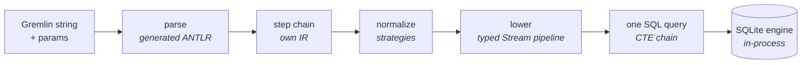

  

# mogwai-db

**A TinkerPop 4 Gremlin graph database with SQLite as its engine — so it runs
natively everywhere SQLite does: in the browser, at the edge on Cloudflare Durable
Objects, and as a single self-contained binary or Docker image on Linux, macOS, and
Windows (arm64 and amd64).**

Point any TinkerPop 4 client at it and it speaks Gremlin over the standard HTTP
wire. SQLite does the real work — storage, indexing, planning, execution — and
mogwai-db is the Gremlin layer over it: every traversal is **compiled to one SQL
query** and handed to SQLite's planner, never interpreted row-at-a-time. Because
the engine is SQLite — the most widely deployed database engine there is — the same
graph database runs client-side in a browser tab, on a Cloudflare Durable Object, or
as a binary on your laptop, with per-tenant isolation and scale-to-zero where the
platform offers them.

> ### Status: pre-alpha — design in the open, not for production
>
> Actively developed on `trunk`; no auth yet, expect churn. Shared so the design and
> progress are visible, not because it's production-ready.
>
> - **Understands the whole language** — 2,298 / 2,298 canonical Gremlin
>   traversals from the official corpus parse (100%).
> - **Executes correctly** — **<!-- L3:passing -->1,793<!-- /L3:passing -->** official TinkerPop Gherkin scenarios pass
>   against a live server through the *unmodified* `gremlin` JS client at tinkerpop `origin/master`,
>   run as a **ratchet** (the number only goes up).
> - **Runs natively on four targets** — browser, Cloudflare edge, native binary, and
>   Docker (multi-arch), each self-contained and published on every release.
> - **Reads + writes + strategies** land across a wide step surface. For the exact
>   per-step edges see the **[feature support matrix](docs/feature-support-matrix.md)**.
> - **Next:** per-graph auth, the OLAP algorithm layer, then the conformance grind.

## SQLite is the engine

Most Gremlin databases ship their own execution engine and interpret a traversal by
walking it step-by-step, pulling rows as they go. mogwai-db doesn't — it uses
**SQLite as the engine** and **lowers each whole traversal to a single parameterised
SQL statement** for SQLite to run. The traversal executes *in the same process as
storage* — no query-engine-to-storage network hop — and k-hop movement becomes
index-only covering scans. The planner, indexes, and query execution are SQLite's;
mogwai-db's job is the compile.

The lowering pipeline is a typed **Stream** model: each read step transforms an
immutable stream (elements → scalars → lists → groups → …), accumulating CTEs, and
the whole plan materialises to GraphBinary only at the root. Movement, filters,
projections, branching, recursion, paths, aggregation, side-effects and the
collection/string/date families all lower through this one engine — no row-at-a-time
interpreter anywhere.

## Where it fits (and where it doesn't)

mogwai-db is **not** trying to be Neptune or TigerGraph. It targets a different,
underserved corner: **many small-to-medium isolated graphs** that live close to the
code that uses them — per-user knowledge graphs, per-tenant SaaS graphs, agent
memory, in-app graphs, personal projects. One graph is one SQLite database, so
isolation is free, and on Cloudflare an idle graph costs essentially nothing.

**Poor fit:** one enormous graph or heavy analytics. A single graph is one SQLite
file / one Durable Object (~10 GB ceiling on Cloudflare), execution is
single-threaded per graph, and the OLAP algorithm layer isn't built yet (it's
intended, and designed as compiled set-based passes rather than a second engine).
Shard-one-logical-graph or PageRank-at-scale is Neptune/TigerGraph's job, not this.

The tick column is an honest **self-rating**: ✅✅ = a real edge · ✅ = on par ·
❌ = a weak spot for now. Other columns show where each database sits.

| Property | mogwai-db | Neptune | Cosmos (Gremlin) | Neo4j Aura | TigerGraph |
|---|---|---|---|---|---|
| Gremlin / TinkerPop | ✅✅ **v4** | v3 | v3 | Cypher | GSQL |
| Runs | ✅✅ browser · edge · binary · docker | managed only | managed only | managed only | managed only |
| Scale-to-zero | ✅✅ ~$0 idle | no | no | no | no |
| Cheap per-tenant fleets | ✅✅ free | costly | costly | costly | costly |
| Single-graph scale | ❌ ~10 GB | ~unbounded | ~unbounded | large | large |
| OLAP | ❌ not yet | strong | weak | strong | strong |
| Maturity | ❌ **pre-alpha** | GA | GA | GA | GA |

Real edges: **runs anywhere** (a browser tab to the edge to a single binary),
**idle cost**, **per-tenant isolation**, **v4 currency**. Honest concessions: **the
scale ceiling** (structural — one SQLite database, one thread) and — for now —
**maturity and OLAP**.

## Agent-driven by design

Graph lifecycle is a thin **REST layer on the same `/gremlin/{graph}` path** —
`PUT`/`GET`/`DELETE` create, inspect, and destroy a graph, identically wherever it
runs; data-plane queries `POST` to it. The server is **self-describing**:
`GET /openapi.json` serves an OpenAPI 3.1 spec and `/docs` an interactive reference.
TinkerPop has no data-plane database-provisioning API — here a graph springs into
being on first access, and management is in-band on the one path.

The direction of travel: that REST + OpenAPI surface makes mogwai-db a natural
**MCP-compatible, agent-driven graph database** — an agent can create graphs, write,
and traverse with no bespoke tooling, just the described HTTP contract.

## One engine, everywhere

Everything above storage — the parser, the compiler, the GraphBinary wire — is
platform-agnostic; because the engine is a synchronous SQLite, only that **SQLite
leaf** and the entry point change per target. One shared contract test runs against
every backend over the real GraphBinary wire, so they're proven identical, not
tested twice:

- **Browser** — SQLite compiled to WebAssembly on the OPFS `opfs-sahpool` VFS,
  fronted by a Service Worker. An unmodified TinkerPop client (or a plain `fetch`)
  reaches a graph that lives entirely in the tab — no server, no network.
- **Edge — Cloudflare Durable Objects** — one DO = one isolated graph over
  `ctx.storage.sql`; the Worker routes `/gremlin/{graph}` to the right DO.
  Scale-to-zero and per-tenant isolation come for free.
- **Native binary & Docker** — a single self-contained executable (Linux, macOS,
  Windows; arm64 and amd64) or a multi-arch container, SQLite on the local disk.

All SQLite, all synchronous, all the same traversal compiler — so a query behaves
identically in a browser tab, on the edge, or on your laptop.

## Run it

Every edition is self-contained and published on each release
([Releases](../../releases)):

- **Binary** — download `mogwai-db-<version>-<os>-<arch>` and run it:
  `./mogwai-db --data-dir ./graphs` (serves on `:8182`; `--help` for flags).
- **Docker** — `docker run -p 8182:8182 -v data:/data ghcr.io/bodar/mogwai-db:latest`
  (linux/amd64 + arm64).
- **Cloudflare** — unzip `mogwai-db-<version>-cloudflare.zip`, set `CLOUDFLARE_API_TOKEN`,
  run `./deploy.sh`. One Durable Object per graph, scale-to-zero.
- **Browser** — unzip `mogwai-db-<version>-browser.zip` into a static folder and add
  `<script type="module" src="mogwai-db.js">`. The whole database runs in the page
  (WASM SQLite); any TinkerPop client or a plain `fetch` works, unmodified.

Then talk to it: `POST /gremlin/{graph}` with `{"gremlin":"g.V().count()"}`, or point a
TinkerPop 4 GLV at the same URL. Management (`PUT`/`GET`/`DELETE`) is on the same path.

## Develop

The toolchain is pinned via [mise](https://mise.jdx.dev): `mise install`, then
`mise run ci` (the full gate) or `mise run test`. The first run auto-provisions the
pinned TinkerPop submodule (grammar + Gherkin corpus + JS cucumber runner) and boots
the Cloudflare half under `wrangler dev`, so it may pause while it clones and starts.
Everything lands on `trunk` — contributions welcome.

## Learn more

- **[Feature support matrix](docs/feature-support-matrix.md)** — the scannable,
  code-grounded map of what compiles and where each partial step stops.
- The name: *mogwai* (魔怪) is Cantonese for a mischievous little devil — fitting for a
  pocket-sized graph that speaks **Gremlin**, the TinkerPop query language.
